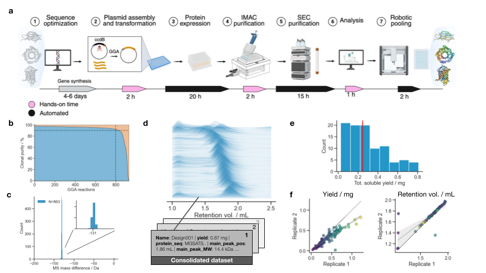

# SAPP - Semi-Automated Protein Production

This jupyter notebook auotmates data processing related to protein engineering experiments. It automates the generation of ECHO cloning transfers, calculates expression and purification parameters, processes Size-Exclusion Chromatography (SEC) data, and generates the plots and final dataframes of the experimental results.

You will need your DNA fragments as ordered from your supplier and the entry vectors used for cloning.

Content:
- `TEMPLATEv6-turbo_mini_space_cowboy.ipynb`: analysis notebook for SAPP runs. Uses utils from `wetlab_utils.py`.
- `wetlab_utils.py`: functions necessary for the execution of the analysis notebook.
- `SEC_calibrations.ipynb`: notebook for generating `.json` SEC calibration files from injections of standards.

